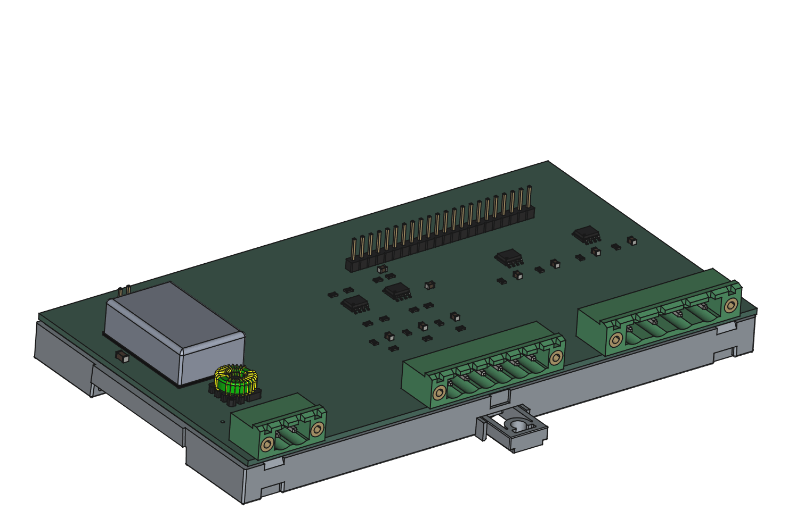
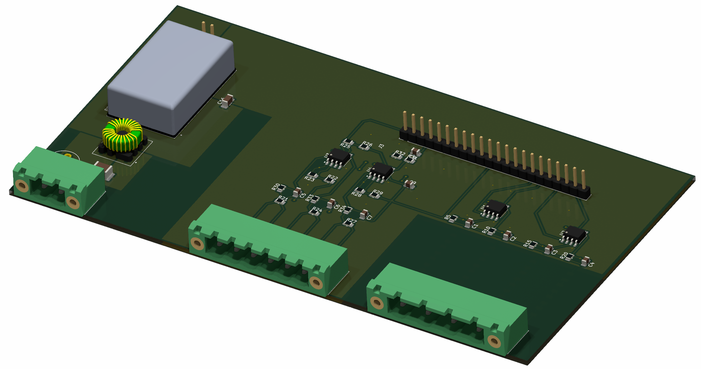
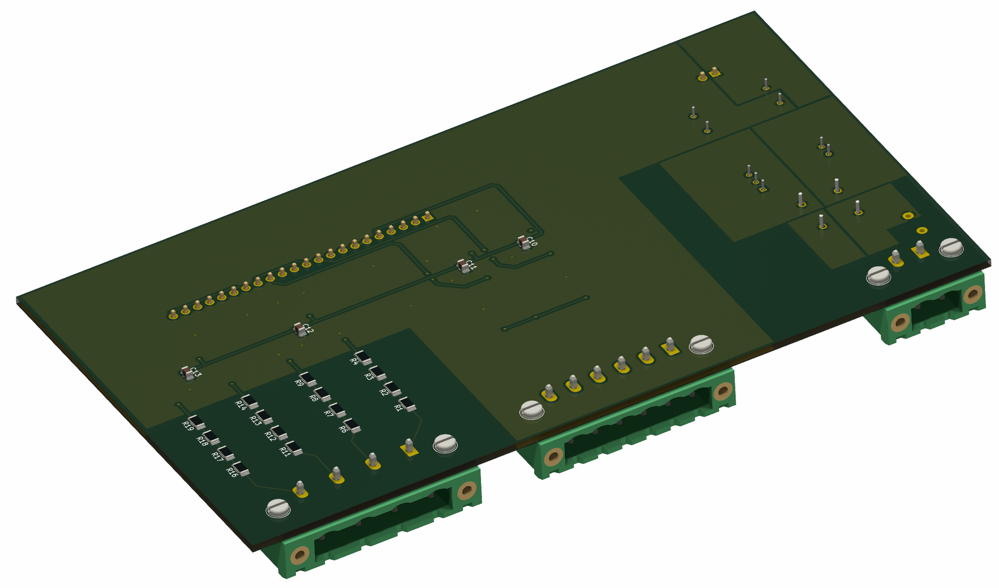
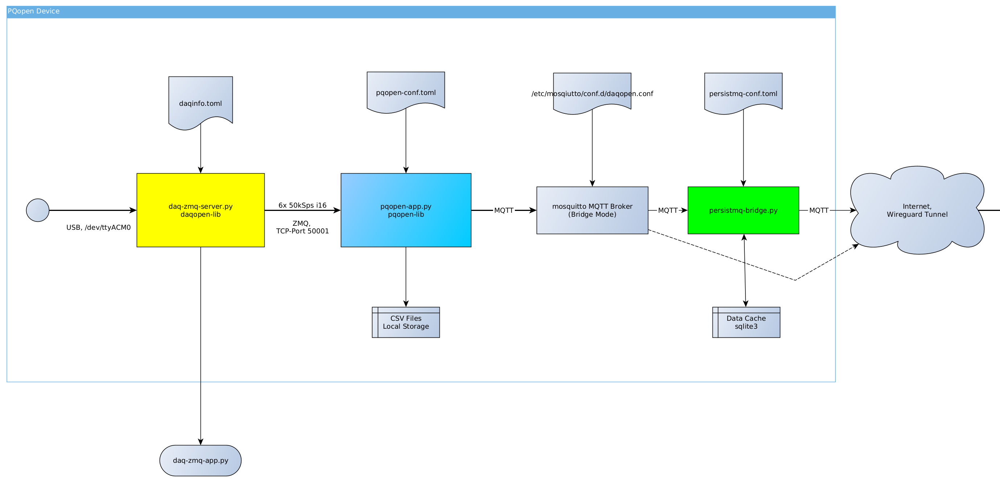

# pqopen-device

**pqopen-device** is a cost-effective, open-source measurement device for monitoring voltage and current within electrical distribution panels. It includes power quality (PQ) functionalities compliant with **IEC 61000-4-30** and is designed for tech enthusiasts and educational institutions. It bases on the [daqopen-lib](https://github.com/DaqOpen/daqopen-lib) for  data acquisition and [pqopen-lib](https://github.com/DaqOpen/pqopen-lib) for the power quality processing part.

> [!WARNING] 
> The actual hardware design is not tested so far. Please wait until an official release.

## Key Features

- **Voltage Measurement**: Measure and analyze 3-phase mains voltage up to 330 VAC
- **Current Measurement**: Use clamps like SCT13-0000 for current measurement
- **Power Quality**: Analysis of RMS, Harmonics, Interharmonics, Flicker and more according to IEC 61000-4-30
- **Data Aggregation**: Use different storage intervals for logging selected parameters to CSV or MQTT
- **Cost-Effective**: Built using open-source hardware like the **Arduino Due** and **Raspberry Pi**.

## Target Audience

- **Tech Enthusiasts**: People interested in measurement technology and electrical energy supply.
- **Educational Institutions**: For training and research purposes.

## Hardware Overview

The device comprises:

- A custom **mainboard** with connectors, power supplies, and signal conditioning for voltage and current.
- **Arduino Due** for data acquisition (running with 55 kS/s per channel)
- **Raspberry Pi 3A+** as the edge device.
- A **standard DIN-rail enclosure** (9 module width).

The main pcb is dual layer with components on both sides. It uses typically SMT components with down to size of 0805 to be soldered by hand.

## Software Overview

The software is split into several components:

### Firmware for Arduino Due

Runs on the Arduino Due for ADC data acquisition (see https://github.com/DaqOpen/daqopen-lib)

Written in C++ for Arduino IDE

### Software for Raspberry Pi

There are three main software components running on the Raspberry Pi edge device to fulfill the measurement needs:

#### daqopen-zmq-server.py

This is the data entry point for the further processing. It receives data form the Arduino Due, adds timestamps as well as channel properties and provides the data via a ZMQ PUB/SUB interface.

This service is time critical due to limited buffer on the Arduino Due and is therefore started with higher priority and realtime scheduler option.

#### pqopen.py

The pqopen app is the main processing application. It connects to the daqopen-zmq-server and receives the data, calculates power values and outputs it on the configured interfaces.

#### persistmq-bridge.py

When data loss is no option, the persistmq-bridge helps to cache data in case of connection loss and resending capability.

## Platform Compatibility

- **Core Library**: Runs on ARM64, AMD64, Linux, and Windows (Mac compatibility untested).
- **Main Application**: Designed specifically for the Raspberry Pi.

## Installation

An **initial setup guide** will be provided to assist with assembling the hardware and installing the software soon.

## Documentation

Documentation for the overarching project is available at [docs.daqopen.com](https://docs.daqopen.com). This documentation will be expanded to include specifics for pqopen-device.

## Contribution

Contributions are welcome, provided they align with the project's vision. Feel free to open issues, submit pull requests, or engage in discussions.

## License

This project is licensed under the **MIT License**.
