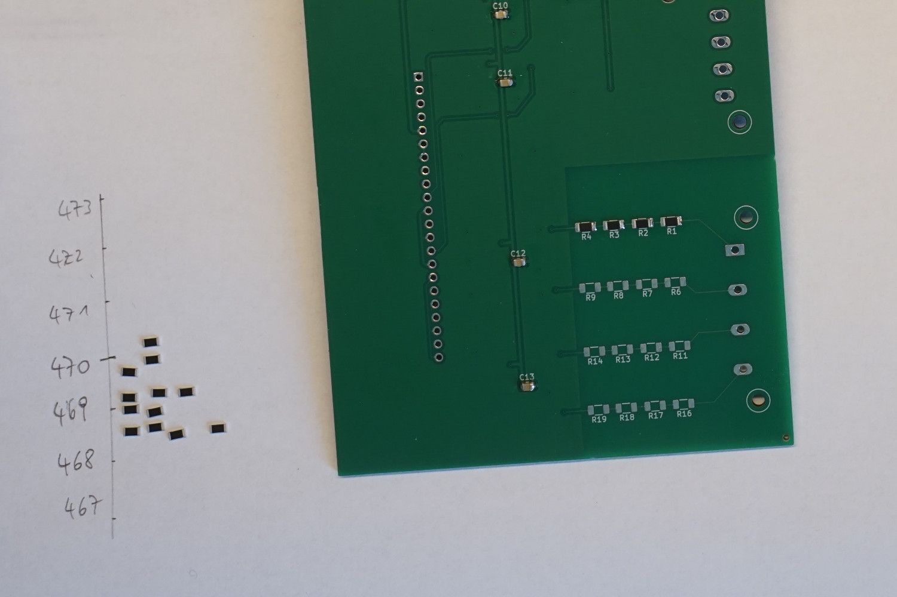
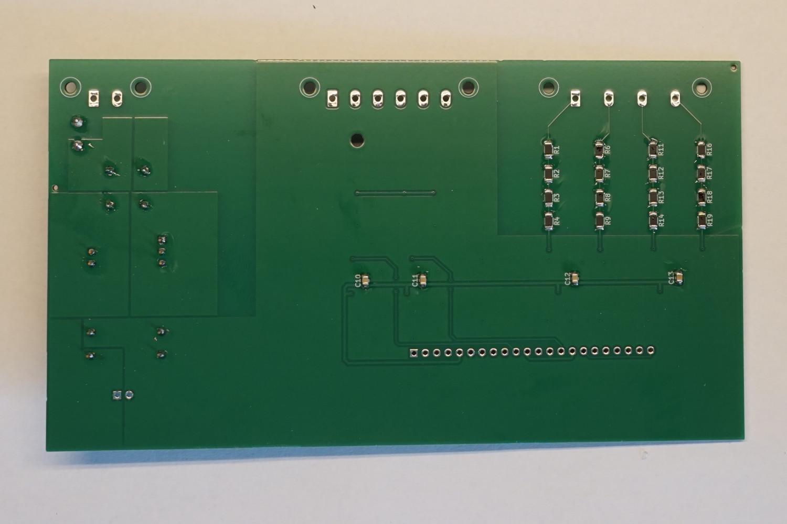

# Assembly of PQopen (Din-Rail)

This Section describes the assembly of the PQopen device. 

Components

| Item              | Count | Info                                                         |
| ----------------- | ----- | ------------------------------------------------------------ |
| pqopen-base-board | 1     | PQopen Base Board with pre-soldered top SMT parts            |
| Arduino Due       | 1     | Arduino Due is used as DAQ Board. Flashed with DueDaq Firmware See [Arduino Setup](../../how-to/prepare-arduino-due.md) |
| Raspberry Pi 3A+  | 1     | Edge Computer + SD-Card (min. 8 GB)                          |
| 9TE Housing       | 1     | e.g. Camdenboss CNMB/9/KIT                                   |

Additional Parts for PCB Completion

| Item               | Count | Info                                    |
| ------------------ | ----- | --------------------------------------- |
| TEN 8-2411WI       | 1     | DC/DC Converter                         |
| TCK-050            | 1     | Filter Choke                            |
| C1812F475K5RACTU   | 1     | DC Input Capacitor                      |
| Phoenix 1806245    | 1     | 4 Pos 7.62mm pitch Through Hole Header  |
| Phoenix 1858785    | 1     | 4 Pos 7.62mm pitch Plug 24-12 AWG Screw |
| Phoenix 1776540    | 1     | 6 Pos 5.08mm pitch Through Hole Header  |
| Phoenix 1778027    | 1     | 6 Pos 5.08mm pitch Plug 24-12 AWG Screw |
| Phoenix 1776508    | 1     | 2 Pos 5.08mm pitch Through Hole Header  |
| Phoenix 1777989    | 1     | 2 Pos 5.08mm pitch Plug 24-12 AWG Screw |
| ROHM KTR18EZPF4703 | 16    | 470 kOhm Resistors for input divider    |

## Step 1: Completion of PCB

This chapter shows the completion of the PCB of Revision 1.

### Power Supply

At first, we start with the power supply part. For this step, we need the following parts:

|                  | Count | Info               |
| ---------------- | ----- | ------------------ |
| TEN 8-2411WI     | 1     | DC/DC Converter    |
| TCK-050          | 1     | Filter Choke       |
| C1812F475K5RACTU | 1     | DC Input Capacitor |
| T2A              | 1     | Input fuse 2A      |

Start with the smallest part, the capacitor.

And work towards the DC/DC converter:

### Backside Capacitors

C10-C13: 100nF 0805

### Input voltage divider

The resistive voltage divider is used to reduce the power grid voltage to ADC levels. It consists of each 4 resistors. 

#### Resistor selection (optional)

To improve accuracy across all 3 input channels, the resistors should be equal value. One option to select the right combination of resistors of each string, is, to sort the resistors according to actual measured value. My way of doing this is, checking each resistor and placing it on a scale, which I draw on paper.

After sorting all resistors, the placement should look something like this:

Now use the resistors alternating top and bottom. This should give you a good mix of values to reach almost same series value.

Here I used the two most top and tow of most bottom resistors and placed them on the first string.

#### Finishing voltage divider

Place all 16 resistors to finish the voltage input divider.

### Pinheader for Arduino

Next, we'll place the pinheader for the Arduino Due. You need a standard 2.54 RM Pinheader with 22 pins. Remove the pins from position 9 and 18 to fit with the Arduino socket.

### Input connectors

To finish the PCB assembly, solder the input connectors for power supply, current sensor and voltage input.

Great, you finished the PCB and can move on with attaching the Arduino.

## Step 2: Attach Arduino and RPi

The Arduino is stacked on the PCB and fixated with a nylon screw. On top of the Arduino, the Raspberry Pi is mounted.

You need 1 placeholder with internal thread, 2 two-sided ones, 3 screws and one bolt.

Use the placeholder as well as the two screws with internal thread and the bolt and attach them to the Arduino.

#### Prepare Raspberry Pi

Use an additional pair of screws and bolts to safely distant the Raspberry from the Arduino

Place the Raspberry on the bottom side of the Arduino (back-to-back) and fix them together the two remaining screws. Before fastening the screws, be sure, both of the screws are in the thread (it is a bit tricky, because it is not 100% in alignment). The flexibility of the nylon components helps to get it done.

### Marriage of PCB and Arduino

One of the last step is now, to connect the Arduino/RPi to the PCB and fix it with another nylon screw.

Note the screw hole in the top-middle of the PCB backside:

The last step is now to wire the USB-Cable and Power Supply (power connection is missing on this picture)

## Step 3: Electrical Check

To check the components and right assembly, we can do a quick-check if everything is working.

1. Temporary disconnect the USB cable and connect the Arduino directly to the PC
2. ... 

## Step 4: Attach Housing